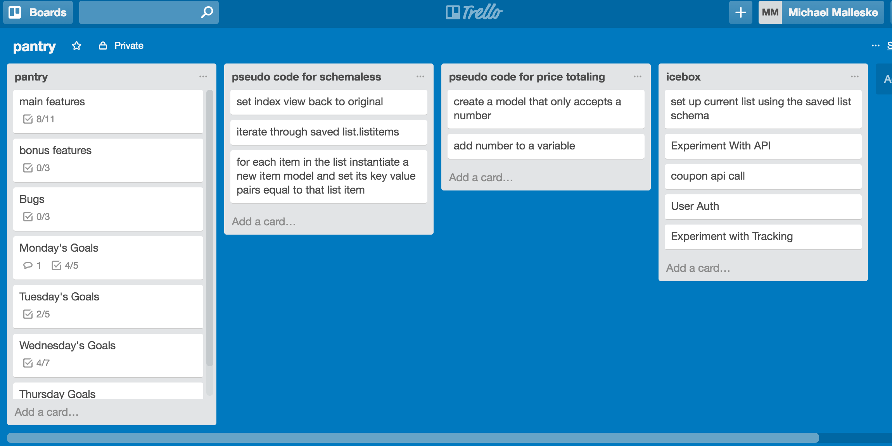

# Pantry

## The App - Make grocery shopping easier!
The purposes of this app is to ease the process of grocery shopping by providing an intuitive listing service. A user can create and save custom grocery lists that automatically total the cost of their groceries. 

## Technologies Used
Node.js, Express.js, Mongoose, mLab(MongoDB), CSS, Photoshop

I used Node and Express to route my app and mLab as my database. A mixture of CSS and photoshop went into the look of the website. 

## Approach Taken
Careful planning was integral to this project. I planned out which models I needed and established how I would structure my data. This app would involve a model that stored an array of other models or subdocuments so planning out my data structures from the beginning helped me prepare for the challenge of editing subdocuments. 

I then drew out my ERDs and looked for ways I could simplify my relationships.

Before starting into the code I created a Trello board with several sections and even some pseudocode to help me keep track of my progress. I had frequent scrums with myself in front of the Trello board to anchor myself. 

Once I started coding I used a template I had created for quickly setting up RESTful routes using express. I focused on getting CRUD functionality before moving onto the more complex routes. 

I frequented the mongoose documentation and researched blogs for people trying to achieve the same objective, namely editing subdocuments. 

I scaled the project as I worked, constantly reprioritizing with my Trello board, so that I was able to get critical features and set a plan for bonus features.

I finished with CSS styling, but am leaving open for much more front end work. 

## User Stories
A user lands on the home page. 
Users are directed to their current list at this time. (In the future, the user will be given a modal to sign up or sign into the app). 
A user can immediately add items to their current list.
An item name is required. If the user enters price information it will automatically be added to the total. 
A user can also create a saved grocery list (e.g. cleaning supplies).
A user can populate their current list with all items from any saved list. 
Users can also edit or delete individual list items.

## Installation Instructions
1. Clone the repository to your local machine
2. Run `npm install` inside the directory to install all the dependecies used in this project.
3. Once the dependecies are installed, you can run `nodemon` in terminal and visit localhost:3000 to view the web app locally.
4. The website can be viewed online at https://swimspotaustin.herokuapp.com/ as well.

## Unsolved Problems
Sometimes the page does not refresh with new information and deleting an item that has not been removed from the view but has been deleted from the database causes the app to crash. 

The checkbox does not persist. I also need to associate model data with the checkbox. 

Additional styling and javascript for front end.

##Features for the future
I would like to add ajax to parts of this app so that it updates dynamically. 

I am currently awaiting approval for an API key that pulls e-coupons from participating stores and uses the grocery list info to respond with a relevant list of coupons. 

I would like to add tracking to purchased grocery items that averages amount of time in between purchases and send notifications to the user to see if they need to restock on that item based on those time intervals. 

